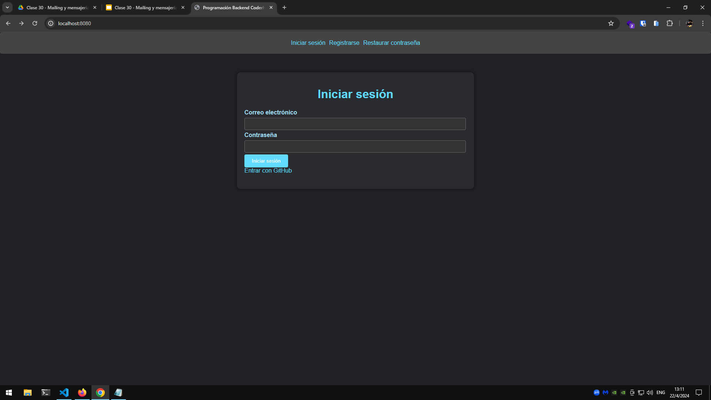
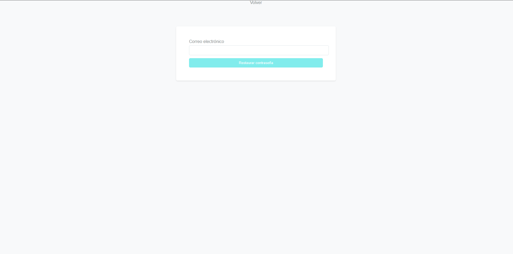
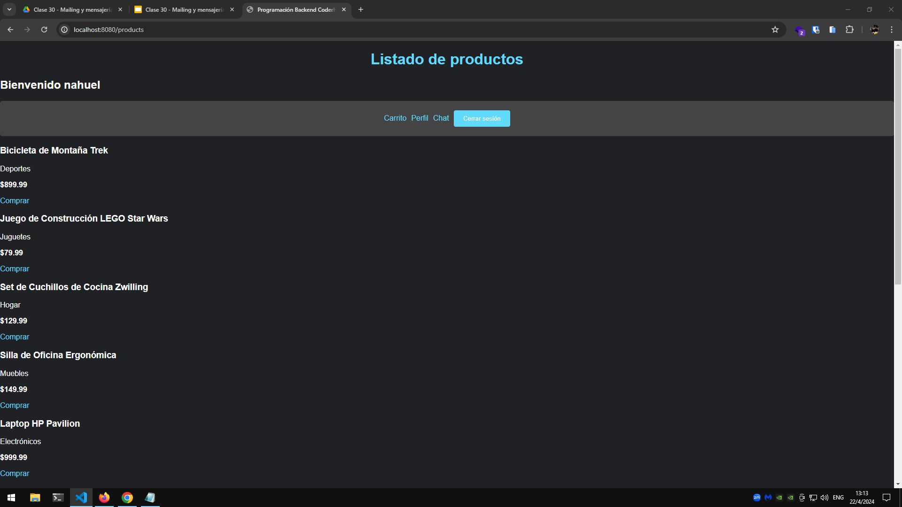

# Proyecto Backend: Sistema de Gestión ecommerce 🛒📦

Este proyecto es un sistema backend desarrollado en Node.js con Express y MongoDB para gestionar carritos de compras, productos y autenticación de usuarios. Además, proporciona una interfaz gráfica de usuario (GUI) para interactuar con las funcionalidades del sistema de forma más amigable. 🚀

## Cómo usar el proyecto 🚀

Requisitos previos 🔍

- Node.js instalado en tu sistema
- MongoDB instalado y en funcionamiento
- Conexión a internet para instalar dependencias

## Pasos para ejecutar el proyecto 🛠️

1 Clonar el repositorio:

```bash
git clone https://github.com/lautiok/backend-50035
```

2 Instalar dependencias:

```bash
cd backend-50035
npm install

```

3 Ejecutar la aplicación:

```bash
npm start
```

La aplicación se ejecutará en el puerto especificado (8080)

## Interfaz Gráfica de Usuario (GUI) 🖥️

Una vez que la aplicación esté en funcionamiento, puedes acceder a la interfaz gráfica de usuario (GUI) abriendo un navegador web y navegando a la dirección http://localhost:8080

La interfaz gráfica proporciona las siguientes funcionalidades:

- Crear un nuevo carrito
- Agregar un producto al carrito
- Ver el contenido del carrito

## Demostración 🎥

A continuación, puedes ver una demostración de la interfaz gráfica de usuario (GUI) en acción:

LOGIN (http://localhost:8080/login)

[](http://localhost:8080/login)

REGISTRO (http://localhost:8080/register)

[](http://localhost:8080/register)

PRODUCTOS (http://localhost:8080/products)

[](http://localhost:8080/products)
